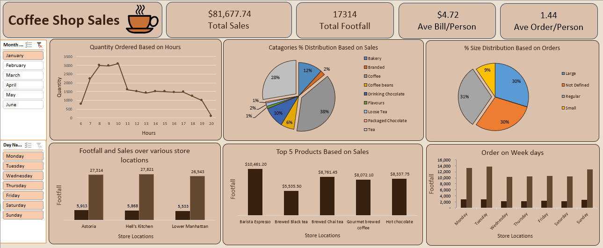

# Coffee Shop Sales Dashboard (Excel Project)

This is my Excel project where I analyzed coffee shop sales data and made a dashboard out of it.

## Problem

I had raw sales data (transaction level) and wanted to answer some basic questions from it:
- Sales by day and hour, and peak selling times
- Total sales per month
- Sales by store location
- Average bill/order per person
- Best selling products (by quantity and revenue)
- Sales by product category and type

## What I did

1. Cleaned the raw data first (checked for blanks/duplicates).
2. Added a few extra columns to help with analysis - Total Bill (qty x price), Month Name, Day Name, and Hour, using simple formulas.
3. Made Pivot Tables for each question - like hour-wise quantity, day-wise sales, month-wise sales, category-wise sales, top 5 products, store-wise sales, and size-wise orders.
4. Used these Pivot Tables to make Pivot Charts (line chart, pie charts, bar charts).
5. Put everything together on one Dashboard sheet with KPI cards on top (Total Sales, Footfall, Avg Bill/Person, Avg Order/Person).
6. Added Slicers (Month and Day) so the dashboard can be filtered.

## Tools used

- Microsoft Excel
- Formulas: TEXT, HOUR, WEEKDAY, MONTH
- Pivot Tables & Pivot Charts
- Slicers

## What I found

- Most orders happen between 8 AM to 11 AM.
- Tuesday and Monday have the highest sales, Wednesday the lowest.
- Coffee is the best-selling category, followed by Tea and Bakery.
- Barista Espresso is the top selling product.
- All 3 stores (Astoria, Hell's Kitchen, Lower Manhattan) have almost equal sales.
- Average bill per person is around $4.72, and average order per person is 1.44.

## How to use

Open the Excel file, go to the Dashboard sheet, and use the slicers to filter by month/day.
